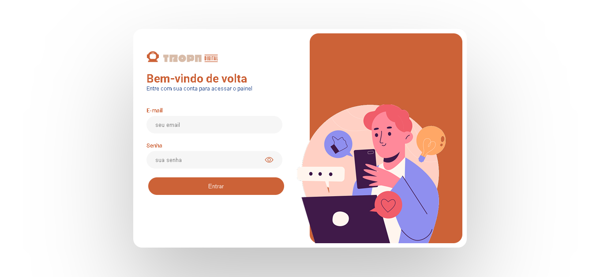
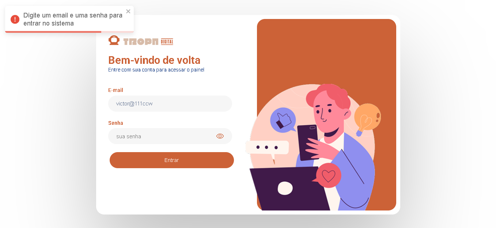
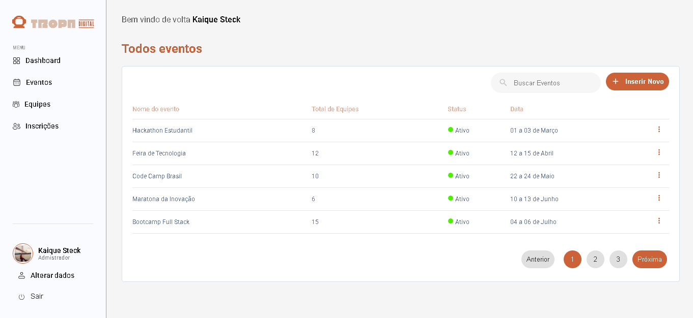
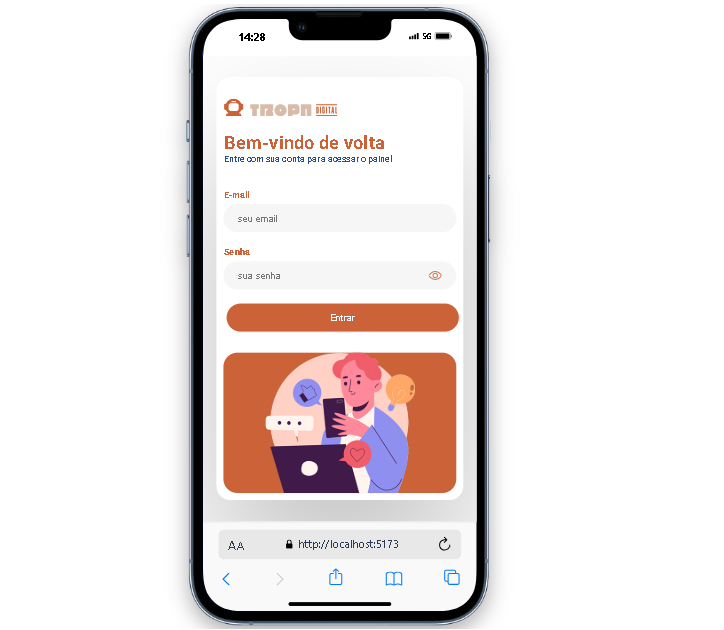
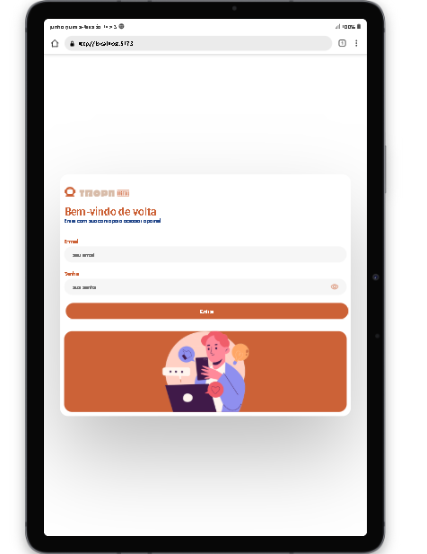
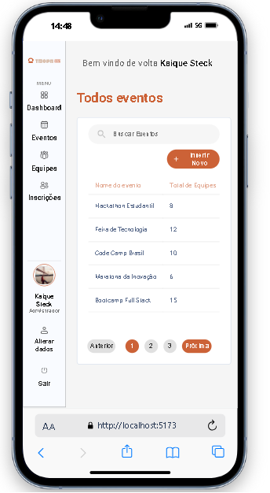
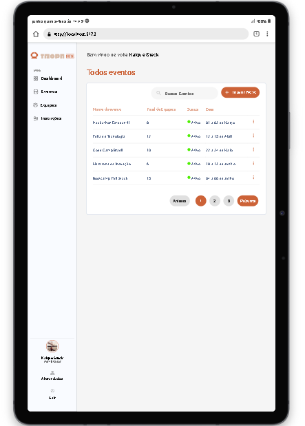

# Projeto Tela de Login + Events

Este projeto foi desenvolvido como um **teste técnico para vaga de Front-End**.  
Trata-se de uma aplicação React utilizando Vite, com foco em responsividade, roteamento,  organização de código e deploy.

🚀 **[Acesse o site do projeto](https://teste-tropa-digital.netlify.app/login)**


## Stack utilizada

-  React
- React-router
-  Vite
-  JavaScript
- Styled-Components
- Netlify


## Como rodar o projeto localmente

1. Clone este repositório:
   ```bash
   
   git clone https://github.com/victorpiinheiro/teste_front.git

  2. Entre na pasta do projeto:

    cd teste_front

  3. Instale as dependências:

    npm install

  4. Rode o servidor de desenvolvimento:

    npm run dev

  5. Abra o navegador no endereço exibido no terminal (normalmente http://localhost:5173)
    


##  🖼️ Demonstração

### 💻 Tela de Login no Desktop



### ⚠️ Login com Erro


###  Pagina Eventos


## 📱 Responsividade
### LOGIN

#### Mobile:


#### Tablet:


### EVENTOS

#### Mobile:


#### Tablet:

## Funcionalidades

### 🔐 Login com autenticação simulada:
 - O sistema permite o login de usuários com validação de credenciais e simulação de autenticação por meio de um token gerado. Esse token é retornado e utilizado para simular sessões autenticadas.

 ### 📅 Página de eventos:
 - Após o login, o usuário tem acesso à listagem de eventos disponíveis no sistema.

  ### 🔎 Busca de eventos::
 - O usuário pode pesquisar eventos pelo nome (ou outro campo, se aplicável), facilitando a localização de eventos específicos.


  ### 📄 Paginação:
 - A listagem de eventos é paginada, permitindo uma navegação entre elas.


##site no ar em:


## Contato

GitHub: https://github.com/victorpiinheiro

LinkedIn: https://www.linkedin.com/in/victorpinheiro-dev
